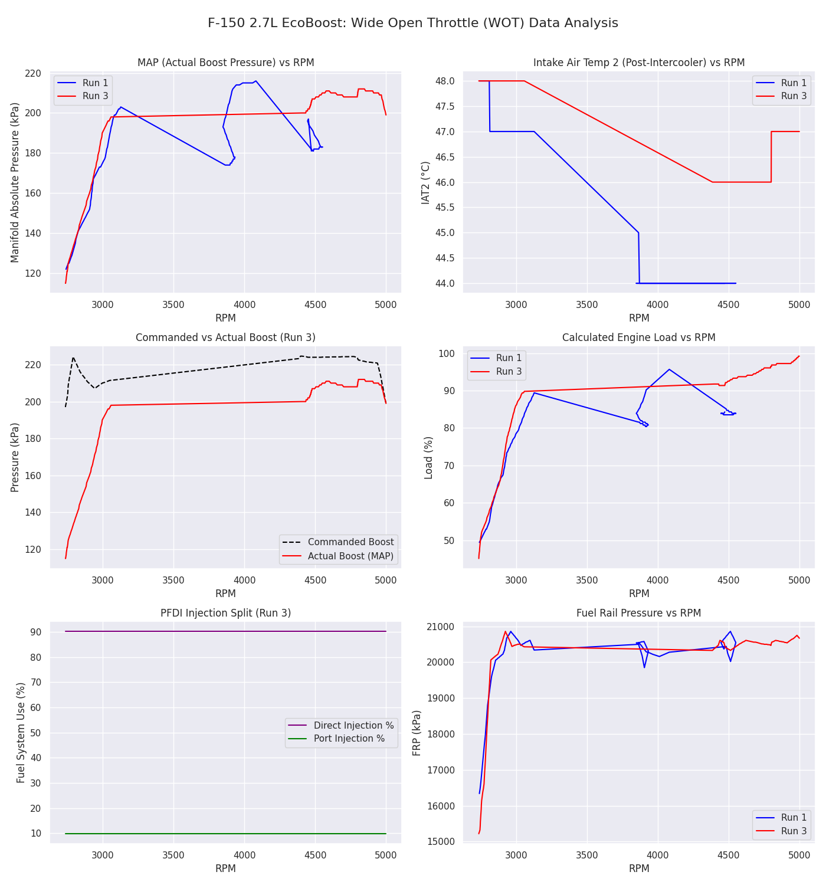
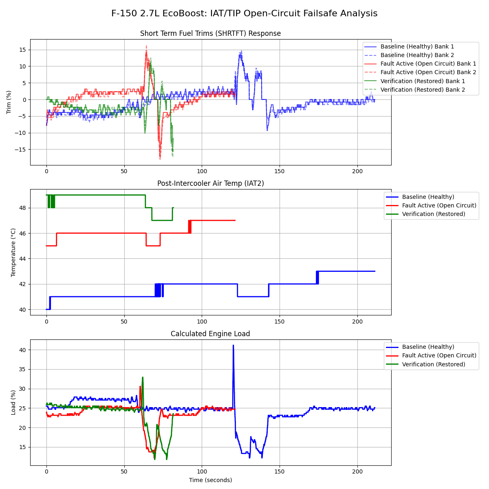

# Automotive Systems Diagnostics & Performance Validation Portfolio
**Platform:** 2018 Ford F-150 (2.7L Twin-Turbocharged EcoBoost V6)  
**Author:** Eliazar Alvarez  
**Education:** B.S. Mechanical Engineering, University of Texas at San Antonio (UTSA)  
**Target Roles:** Field Technical Specialist | Systems Validation Engineer | Quality Operations  

---

## 📌 Executive Overview
This repository contains end-to-end diagnostic engineering studies, empirical telemetry parsing scripts, and factory-standard technical documentation. Field telemetry was gathered via high-speed multiplexed OBD-II/CAN bus logging (FORScan / OBDLink EX) at 10 Hz and processed through custom MATLAB analytical scripts.

### 📄 Key Deliverables & Documentation
* 📑 [**Download Master Engineering Portfolio (PDF)**](docs/Eliazar_Alvarez_Engineering_Portfolio.pdf)
* 📘 [Case Study 1: Volumetric Efficiency & Boost Validation](docs/1_Project_VE_Validation.pdf)
* ⚡ [Case Study 2: Open-Circuit Sensor Fault & Failsafe Mapping](docs/2_Project_Failsafe_Logic.pdf)
* 📝 [Technical Service Bulletin #26-1041: CAC Thermal Saturation](docs/3_Project_TSB_HeatSoak.pdf)

---

## 🚀 Projects Overview

### Project 1: Empirical Volumetric Efficiency (VE) & Boost Validation
* **Objective:** Establish a high-load performance baseline by mapping absolute manifold pressure, engine load (VE proxy), and Port/Direct Injection (PFDI) utilization.
* **Key Finding:** Validated peak actual boost delivery of **211 kPa** (16.2 psi boost above 99 kPa atmospheric baseline) with a peak calculated engine load of **98%**. Direct injection accounted for **89%** of total fueling demand at 20,000 kPa rail pressure.

<p align="center">
  
</p>

---

### Project 2: Open-Circuit Fault Simulation & Failsafe Logic Analysis
* **Objective:** Isolate closed-loop powertrain adaptations during a hardware sensor failure under high ambient thermal conditions (92°F+ Texas heat).
* **Fault Injection:** Simulated an open circuit on the primary Intake Air Temperature (IAT) sensor (DTC P0113).
* **Key Finding:** Telemetry mapped the PCM’s rich-bias failsafe compensation, shifting Short-Term Fuel Trims (SHRTFT1) from **-0.68%** to **+0.57%** (with spikes to +14%) to mitigate lean-burn detonation. Confirmed multi-sensor network isolation via secondary manifold sensor (IAT2) tracking heat soak from 41°C to 48°C.

<p align="center">
  
</p>

---

### Project 3: Technical Service Bulletin (TSB #26-1041)
* **Topic:** Charge Air Cooler (CAC) Thermal Saturation Under Sustained High-Load Operation.
* **Core Communication:** Authored an OEM-standard technical document detailing root-cause diagnostic logic for un-coded perceived power loss when post-intercooler temps exceed 45°C (113°F).

---

## 🛠️ Toolchain & Software Architecture
* **Telemetry & Hardware:** FORScan Diagnostics, OBDLink EX Multi-Protocol USB Interface (SAE J1979 / ISO 15031).
* **Data Processing & Analytics:** MATLAB (Signal parsing, speed-density modeling, multi-channel time-series visualization).
* **Documentation Standards:** SAE J2012 DTC format, 8D Root Cause Analysis (RCA), OEM Technical Manual Structure.

---

## 💻 How to Run the MATLAB Scripts
1. Clone this repository:
   ```bash
   git clone [https://github.com/your-username/automotive-diagnostics-f150-ecoboost.git](https://github.com/your-username/automotive-diagnostics-f150-ecoboost.git)
